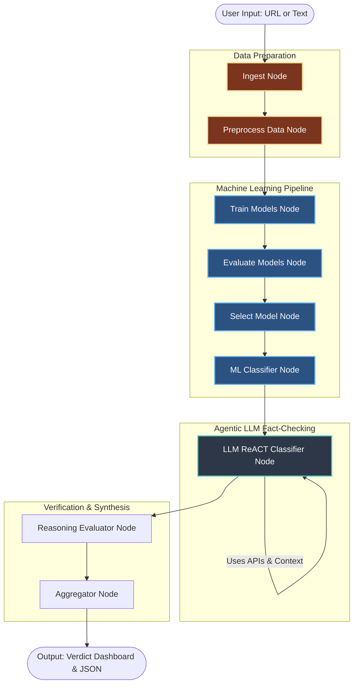

# Fake News Detection Agent

A LangGraph-based agentic pipeline for detecting fake news. This project implements a **two-phase classification workflow** combining traditional Machine Learning alongside an autonomous **LLM ReACT Agent**. The pipeline evaluates both stylistic features and contextual truth, finalizing its decision through DeepEval reasoning verification and weighted aggregation.

---

## Architecture & Workflow

The pipeline operates via a central `AgentState` directed through a sequence of LangGraph nodes. The workflow strictly adheres to the ReACT (Reasoning + Acting) model, where modular tools extract features, verify claims, and train models dynamically.

### Agentic Pipeline Flow



---

## Detailed Node Pipeline

The LangGraph ecosystem stores all intermediate context in a central `AgentState` dictionary. The following breaks down each node's role in the pipeline:

### 1. Ingestion Node (`src/nodes/ingestion.py`)
- **Purpose:** Receives raw user input, converts URLs to text, and parses stylistic metrics.
- **Skill Instruction:** `skills/ingestion.md`
- **Tools Available:** `fetch_url_tool`, `calculate_features_tool`
- **Inputs:** `raw_input`, `input_type`
- **Outputs to State:** `article_text`, `article_title`, `word_count`, `caps_ratio`, `lexical_density`, `has_dateline`

### 2. Preprocess Data Node (`src/nodes/preprocess_data.py`)
- **Purpose:** Cleans the data, resolving format issues and aggressively stripping dataset leakage (e.g., hidden publisher bylines like 'Reuters').
- **Skill Instruction:** `skills/preprocessing.md`
- **Tools Available:** `preprocess_leakage_tool`
- **Inputs:** `article_text`
- **Outputs to State:** `article_text_ml`, `article_text_llm`, dataset splits (`train_size`, `test_size`).

### 3. Train Models Node (`src/nodes/train_models.py`)
- **Purpose:** Fits candidate ML algorithms (Logistic Regression, Random Forest, SVM, Neural Network). If a v2 cached model exists, it correctly skips.
- **Skill Instruction:** `skills/train_models.md`
- **Inputs:** Numeric + TF-IDF scaled arrays based on `article_text_ml`.
- **Outputs to State:** `trained_candidates_path`, `model_trained`

### 4. Evaluate Models Node (`src/nodes/evaluate_models.py`)
- **Purpose:** Calculates Confusion Matrices, ROC curves, and Precision/Recall metrics on test data for all trained pipelines.
- **Skill Instruction:** `skills/evaluate_models.md`
- **Inputs:** `trained_candidates_path`
- **Outputs to State:** `candidate_validation_results`, `candidate_test_results`, `roc_curve_path`

### 5. Select Model Node (`src/nodes/select_model.py`)
- **Purpose:** Picks the best-performing classical ML algorithm to act as the primary classifier representation.
- **Skill Instruction:** `skills/select_model.md`
- **Inputs:** `candidate_validation_results`
- **Outputs to State:** `selected_model_name`, `model_path`, `training_artifact_path`

### 6. ML Classifier Node (`src/nodes/ml_classifier.py`)
- **Purpose:** Runs traditional ML inference on the specific article using the winning algorithm.
- **Skill Instruction:** `skills/ml_classification.md`
- **Inputs:** `model_path`, `article_text_ml`
- **Outputs to State:** `ml_label`, `ml_score` (Confidence between 0-1)

### 7. LLM Classifier Node (`src/nodes/llm_classifier.py`)
- **Purpose:** A `gpt-4o-mini` ReACT agent that autonomously fact-checks the text, measures sensationalism, and looks up credible sources.
- **Skill Instruction:** `skills/llm_classification.md` 
- **Tools Binded:** `sentiment_analysis_tool`, `source_credibility_tool`, `cross_reference_tool`
- **Inputs:** `article_text_llm`, `source_domain`
- **Outputs to State:** `llm_label`, `llm_score`, `llm_reasoning`

### 8. Reasoning Evaluator Node (`src/nodes/evaluator.py`)
- **Purpose:** Uses **DeepEval** to programmatically score the LLM's `llm_reasoning` trace to ensure its conclusion stems from evidence and not hallucinations.
- **Skill Instruction:** `skills/reasoning_evaluation.md`
- **Inputs:** `llm_reasoning`, `article_text`
- **Outputs to State:** `eval_score` (Quality of reasoning: 0-1)

### 9. Aggregator Node (`src/nodes/aggregator.py`)
- **Purpose:** Calculates final verdict. Uses the `eval_score` to determine the weighting between the ML Model array and the LLM's prediction.
- **Skill Instruction:** `skills/aggregation.md`
- **Inputs:** `ml_label`, `llm_label`, `eval_score`
- **Outputs to State:** `final_label` (REAL/FAKE), `final_score`, `summary`, `explanation`

---

## Standalone ML Training & Evaluation

Outside the LangGraph pipeline, standalone scripts handle ML model training and evaluation. These are organized under `src/ml/` and `src/evaluation/`.

### Project Structure (Standalone ML)

```
src/
├── ml/                          # Standalone ML training
│   ├── training2.py             # Training node with GridSearchCV tuning
│   ├── training2_simple.py      # Training node (baseline, no tuning)
│   └── preprocess_data_v2.py    # V2 preprocessing (stronger dedup)
├── evaluation/                  # Evaluation & sense-check scripts
│   ├── basic_v1.py              # V1 model evaluation
│   ├── basic_v2.py              # V2 model evaluation
│   ├── basic2.py                # V2 detailed evaluation with plots
│   ├── sense_check_v1.py        # V1 leakage & ablation analysis
│   ├── sense_check_v2.py        # V2 leakage & ablation analysis
│   └── compare_v1_v2.py         # V1 vs V2 comparison
new_test_training_v1.py          # Runner: V1 preprocess + train
new_test_training_v2.py          # Runner: V2 preprocess + train
```

### Running Standalone Training

```bash
# Train V1 (basic dedup)
python new_test_training_v1.py

# Train V2 (stronger canonical dedup)
python new_test_training_v2.py

# Run evaluations (from project root)
python -m src.evaluation.basic_v1
python -m src.evaluation.basic_v2
python -m src.evaluation.basic2
python -m src.evaluation.sense_check_v1
python -m src.evaluation.sense_check_v2
python -m src.evaluation.compare_v1_v2
```

Outputs are saved to:
- `models/v1/` and `models/v2/` — trained model artifacts
- `evaluation_outputs/` — metrics CSVs, confusion matrices, ROC curves, comparison charts

---

## Setup & Execution

### 1. Installation
```powershell
# Clone the repository
git clone <repo-url>
cd <repo-dir>

# Setup virtual environment mapped to local Python
python -m venv venv
.\venv\Scripts\activate

# Install heavy dependencies 
pip install -r requirements.txt
```

### 2. Configuration
Copy `.env.example` to `.env` and fill in API resources.
```env
OPENAI_API_KEY=your_key
NEWS_API_KEY=your_key
GRADIO_SERVER_PORT=7861
```

### 3. Usage
To launch the interactive verification dashboard, which builds all plots, evaluates all nodes, and initializes Gradio:
```powershell
python main.py
```
*Note: Due to cached training artifacts, initial execution takes ~30 seconds to load the state environment.*

### Data Ecosystem
[Kaggle Fake and Real News Dataset](https://www.kaggle.com/datasets/clmentbisaillon/fake-and-real-news-dataset?resource=download)