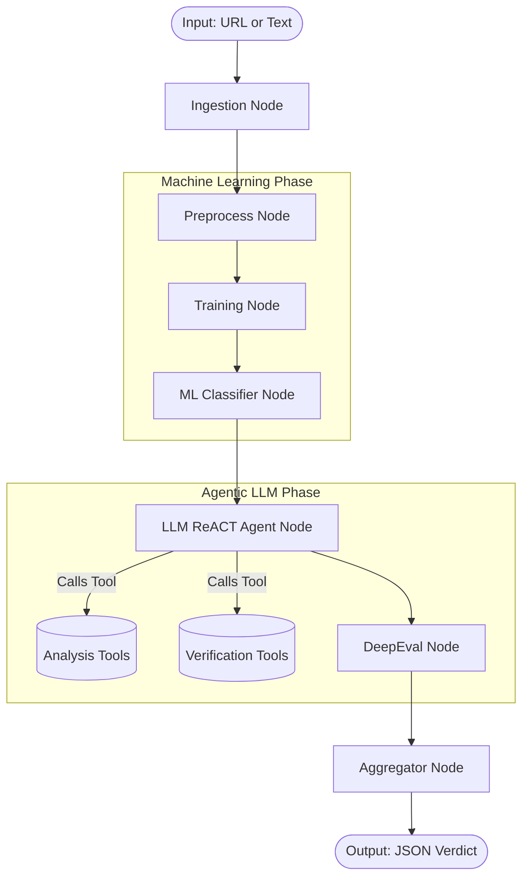

# Fake News Detection Agent

LangGraph-based agentic pipeline for detecting fake news using **two-phase classification** (ML + LLM ReACT Agent) with **DeepEval** metrics for automated verification.

## Architecture & Workflow

The pipeline orchestrates robust data cleaning, ML predictions, and finally an autonomous LLM ReACT agent that actively searches the web to verify assertions and check domain credibility before deciding.



## Project Structure

This project uses an agent-oriented design where declarative instructions (`skills/`) drive execution behaviors (`src/utils/`).

```
├── main.py                    # Gradio UI entry point (Coming Soon)
├── test_pipeline.py           # End-to-end pipeline test suite
├── src/
│   ├── state.py               # AgentState definition (shared state dict)
│   ├── graph.py               # LangGraph wiring (compiles nodes)
│   ├── nodes/                 # Core Graph Steps
│   │   ├── ingestion.py       # Detects URL/Text, formats initial state
│   │   ├── preprocess_data.py # Dataset-level cleaning (Kaggle data)
│   │   ├── training.py        # ML model training
│   │   ├── ml_classifier.py   # Traditional NLP classification
│   │   ├── llm_classifier.py  # LangChain ReACT Agent
│   │   ├── evaluator.py       # DeepEval LLM evaluation
│   │   └── aggregator.py      # Weights ML & AI scores
│   └── utils/                 # Python Tool Logic
│       ├── ingestion_tools.py # URL scraping, feature calc
│       ├── preprocessing_tools.py # Data leakage redaction
│       ├── analysis_tools.py  # Sentiment & Credibility APIs
│       └── verification_tools.py # NewsAPI cross-referencing
├── skills/                    # Markdown instructions for the Agent
│   ├── ingestion.md           
│   ├── preprocessing.md
│   ├── analysis.md
│   └── verification.md
├── models/                    # Saved ML / Training artifacts
├── data/                      # Kaggle Fake/True datasets
├── .env.example               # Keys: NewsAPI & OpenAI
└── requirements.txt
```

## How the LLM ReACT Agent Works
During the `llm_classifier_node`, a `gpt-4o-mini` instance operates autonomously.
It explicitly follows the systemic constraints declared in the `skills/*.md` files, gathering external context via LangChain `@tool` bindings (e.g. `cross_reference_tool`, `sentiment_analysis_tool`) before outputting its final `REAL`/`FAKE` JSON object.

## Skills, Nodes, and Tools Mapping

The pipeline relies on distinct **Skills** (Markdown files guiding the LLM) and **Tools** (Python logic executed by the Agent or Nodes). Here is how they are distributed:

| Node | Active Skill Instruction | Available Tools | Purpose |
|------|--------------------------|-----------------|---------|
| **Ingestion Node** | `skills/ingestion.md` | `fetch_url_tool`<br>`calculate_features_tool` | Scrapes raw web pages and runs stylistic metrics (e.g. Caps Ratio, Lexical Density). |
| **Preprocess Data Node** | `skills/preprocessing.md` | `preprocess_leakage_tool` | Rips out dataset leakage markers (like "(Reuters) -") and bylines so ML models learn logic, not publisher tags. |
| **LLM Classifier Node** | `skills/analysis.md`<br>`skills/verification.md` | `sentiment_analysis_tool`<br>`source_credibility_tool`<br>`cross_reference_tool` | The core ReACT Agent bind. It fetches tone evaluation and domain credibility, then explicitly cross-references claims against NewsAPI. |

## Setup

```bash
# 1. Clone the repo
git clone <repo-url>

# 2. Create virtual environment
python -m venv venv
source venv/bin/activate   # or venv\Scripts\activate on Windows

# 3. Install dependencies
pip install -r requirements.txt

# 4. Copy env template and add your keys (OpenAI & NewsAPI)
cp .env.example .env

# 5. Run the end-to-end test pipeline
python test_pipeline.py
```

### Data Source
[Kaggle Fake and Real News Dataset](https://www.kaggle.com/datasets/clmentbisaillon/fake-and-real-news-dataset?resource=download)